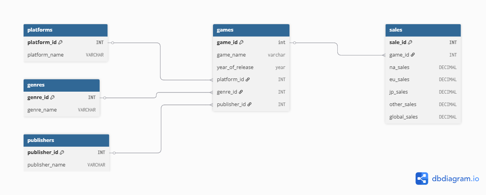

# Press Play for Insights: SQL Dashboard on Video Games

This project simulates an analytics dashboard using SQL. It focuses on global video game sales and uses structured querying and relational design to extract business-ready insights.

## TL;DR
Designed a SQL-powered mock dashboard to analyze global video game sales without Power BI or Tableau. This project involved data modeling, relational joins, ASCII-based charts, and CTE logic to uncover platform trends, genre performance, sales buckets, and publisher dominance. The goal? Prove that clean backend logic *is* storytelling.

## Table of Contents
* [Overview](#overview)
* [Entity Relationship Diagram](#entity-relationship-diagram)
* [Database Structure](#database-structure)
* [Key Questions Answered](#key-questions-answered)
* [KPIs & Insights](#kpis--insights)
* [Tools Used](#tools-used)
* [Folder Structure](#folder-structure)
* [Case Study: Behind the Queries](#case-study-behind-the-queries)
* [Markdown](#markdown)
* [Why This Project Matters](#why-this-project-matters)
* [What I'd Explore Next](#what-id-explore-next)
* [Let's Connect](#lets-connect)

## Overview 

Using raw game sales data, this project transforms a flat file into a relational database and builds SQL-based *dashboard tiles* that mimic visual analytics, all without Power BI or Excel. It covers platform performance, genre patterns, publisher trends, and year-over-year global sales. 

## Entity Relationship Diagram (ERD)
Here's a clear visual map of how the core tables connect; it's the backbone of the database structure, showing relationships and keys that power all of the SQL magic behind the insights.


> Designed using dbdiagram.io

## Database Structure

Data was modeled into 5 main tables: 
- `games` - game details (name, platform, genre, etc.)
- `platforms` - platform names
- `genres` - genre types
- `publishers` - publisher information
- `sales` - regional and global sales

All tables are linked using foreign keys, and the schema was manually designed for clarity and efficiency.

## Key Questions Answered

 - Which platforms generate the highest global sales?
 - Which publishers dominate the market?
 - What are the highest and lowest-performing game genres?
 - How have global sales trended over the years?
 - What type of games fall into the Blockbuster vs Niche sales bucket?

## KPIs & Insights

Each insight below is written using SQL Common Table Expressions (CTEs) to simulate a dashboard tile.

### Top 5 Platforms by Global Sales
Xbox 360 led the pack thanks to its deep market penetration in North America and Europe, a prime example of how regional dominance can outperform pure tech specs.

```sql
-- This is a SQL code block
WITH platform_sales AS (
 SELECT
  p.platform_name, ROUND(SUM(s.global_sales), 2) AS Total_Sales
  FROM sales s
  JOIN games g ON s.game_id = g.game_id
  JOIN platforms p ON g.platform_id = p.platform_id
  GROUP BY p.platform_name
)
SELECT platform_name, Total_Sales,
REPEAT ('▓', ROUND(total_sales / 1000)) AS Ascii_Chart
FROM platform_sales
ORDER BY Total_Sales DESC
LIMIT 5;
```
```
|Platform  |Global Sales (in millions)     | Ascii_Chart      |
|----------|-------------------------------|------------------|
| Xbox 360 | 10,835.41                     | ▓▓▓▓▓▓▓▓▓▓▓      |
| Ps3      | 10,197.72                     | ▓▓▓▓▓▓▓▓▓▓       |
| Ps2      | 7,325.55                      | ▓▓▓▓▓▓▓          |
| Wii      | 6,198.93                      | ▓▓▓▓▓▓           |
| Ds       | 4,263.75                      | ▓▓▓▓             |
```

### Top 5 Publishers
Nintendo's legacy IPs, family-friendly content, and tight hardware-software ecosystem allowed it to dominate, showing that owning the entire stack is still unbeatable.

```sql
-- This is a SQL code block
WITH publisher_sales AS (
 SELECT
 pub.publisher_name,
 ROUND(SUM(s.global_sales), 2) AS Total_Sales
 FROM sales s
 JOIN games g ON s.game_id = g.game_id
 JOIN publishers pub ON g.publisher_id = pub.publisher_id
 GROUP BY pub.publisher_name
)
SELECT publisher_name,
  Total_Sales,
  REPEAT('▓', ROUND(total_sales / 1000)) AS Ascii_Chart
FROM publisher_sales
ORDER BY total_sales DESC
LIMIT 5;
```
```
|Publisher                   |Global Sales (in millions) | Ascii_Chart     |
|----------------------------|---------------------------|-----------------|
|Nintendo                    | 14,462.46                 | ▓▓▓▓▓▓▓▓▓▓▓▓▓▓  |
|Electronic Arts             | 11,098.62                 | ▓▓▓▓▓▓▓▓▓▓▓     |
|Activision                  | 9,703.53                  | ▓▓▓▓▓▓▓▓▓▓      |
|Take-Two Interactive        | 4,204.98                  | ▓▓▓▓            |
|Sony Computer Entertainment | 3,642.57                  | ▓▓▓▓            |
```

### Genre Sales Performance

- Highest-Selling Genre : **Action** - 13,102.11M
Fast-paced and accessible. Action games dominate global sales, proving that adrenaline still sells better than complexity.

```sql
-- This is a SQL code block
WITH genre_sales AS (
 SELECT 
 genr.genre_name, ROUND(SUM(s.global_sales), 2) AS Total_Sales
 FROM sales s
 JOIN games g ON s.game_id = g.game_id
 JOIN genres genr ON g.genre_id = genr.genre_id
 GROUP BY genr.genre_name
)
SELECT genre_name,
  Total_Sales,
  REPEAT('▓', ROUND(total_sales / 500)) AS Ascii_Chart
FROM genre_sales
ORDER BY total_sales DESC
LIMIT 1;
```
```
|Genre Name          | Total Sales      | Ascii_Chart                |
|--------------------|------------------|----------------------------|
| Action             | 13,102.11        | ▓▓▓▓▓▓▓▓▓▓▓▓▓▓▓▓▓▓▓▓▓▓▓▓▓▓ |
```

- Lowest-Selling Genre: **Strategy** - 498.96M
Despite being beloved by a niche, strategy games struggle to scale, showing that depth doesn't always equal mass appeal.

```sql
-- This is a SQL code block
WITH genre_sales AS (
 SELECT 
 genr.genre_name, ROUND(SUM(s.global_sales), 2) AS Total_Sales
 FROM sales s
 JOIN games g ON s.game_id = g.game_id
 JOIN genres genr ON g.genre_id = genr.genre_id
 GROUP BY genr.genre_name
)
SELECT genre_name,
  Total_Sales,
  REPEAT('░', ROUND(total_sales / 100)) AS Ascii_Chart
FROM genre_sales
ORDER BY total_sales ASC
LIMIT 1;
```
```
|Genre Name          | Total Sales      | Ascii_Chart  |
|--------------------|------------------|--------------|
|Strategy            | 498.96           | ░░░░░        |
```

### Global Sales Trend by Year
Video game sales peaked in the 2008-2010 era, a golden window driven by console maturity, cross-platform titles, and global reach. Post-2015, the decline signals a market shift toward digital platforms and mobile.
(Simulated ASCII line chart previewed in full markdown)

```sql
-- This is a SQL code block
WITH sales_trend AS (
 SELECT
 g.year_of_release, ROUND(SUM(s.global_sales), 2) AS Total_Global_Sales
 FROM sales s
 JOIN games g ON s.game_id = g.game_id
 GROUP BY g.year_of_release
 ORDER BY g.year_of_release
)
SELECT  year_of_release,
  Total_Global_Sales,
  REPEAT('█', ROUND(total_global_sales / 500)) AS Ascii_Chart
FROM sales_trend
ORDER BY year_of_release;
```
```
| Year | Global Sales | Ascii_Chart    |
|------|--------------|----------------|
| 1980 | 63.63        |                |
| 1981 | 151.83       |                |
| 1982 | 99.36        |                |
| 1983 | 68.58        |                |
| 1984 | 404.91       | █              |
| 1985 | 436.68       | █              |
| 1986 | 251.19       | █              |
| 1987 | 143.37       |                |
| 1988 | 389.25       | █              |
| 1989 | 605.16       | █              |
| 1990 | 396.99       | █              |
| 1991 | 173.25       |                |
| 1992 | 591.39       | █              |
| 1993 | 247.05       |                |
| 1994 | 506.34       | █              |
| 1995 | 359.73       | █              |
| 1996 | 1,191.51     | ██             |
| 1997 | 1,092.69     | ██             |
| 1998 | 1,423.26     | ███            |
| 1999 | 1,311.84     | ███            |
| 2000 | 995.04       | ██             |
| 2001 | 2,188.71     | ████           |
| 2002 | 2,231.01     | ████           |
| 2003 | 1,836.18     | ████           |
| 2004 | 2,330.46     | █████          |
| 2005 | 2,271.69     | █████          |
| 2006 | 3,253.95     | ███████        |
| 2007 | 4,718.16     | █████████      |
| 2008 | 5,122.26     | ██████████     |
| 2009 | 4,078.26     | ████████       |
| 2010 | 4,778.28     | ██████████     |
| 2011 | 4,569.30     | █████████      |
| 2012 | 3,048.57     | ██████         |
| 2013 | 4,844.16     | ██████████     |
| 2014 | 4,679.82     | █████████      |
| 2015 | 2,853.09     | ██████         |
| 2016 | 328.05       | █              |
```
### Sales Bucket Heatmap
Only a tiny fraction of games become true blockbusters; most titles hover in the "Niche Success" zone, highlighting the importance of diversified portfolios over chasing unicorns.

```sql
-- This is a SQL code block
WITH sales_buckets AS (
 SELECT g.game_name,
  CASE
   WHEN s.global_sales >= 20 THEN 'Blockbuster (20M+)'
   WHEN s.global_sales >= 10 THEN 'Hit (10M - 19.9M)'
   WHEN s.global_sales >= 5 THEN 'Moderate Hit (5M - 9.9M)'
   WHEN s.global_sales >= 1 THEN 'Niche Success (1M - 4.9M)'
   ELSE 'Low Impact (< 1M)'
END AS sales_bucket
FROM sales s
JOIN games g ON s.game_id = g.game_id
)
SELECT sales_bucket, 
  COUNT(*) AS game_count,
  REPEAT('▒', ROUND(COUNT(*) / 500)) AS Ascii_Chart
FROM sales_buckets
GROUP BY sales_bucket
ORDER BY game_count DESC;
```
```
| Sales Bucket                | Game Count | Ascii_Chart                       |
|-----------------------------|------------|-----------------------------------|
| Niche Success (1M–4.9M)     | 16,425     | ▒▒▒▒▒▒▒▒▒▒▒▒▒▒▒▒▒▒▒▒▒▒▒▒▒▒▒▒▒▒▒▒▒ |
| Moderate Hit (5M–9.9M)      | 1,899      | ▒▒▒▒                              |
| Hit (10M–19.9M)             | 603        | ▒                                 |
| Blockbuster (20M+)          | 189        |                                   |
```

## Tools Used 

 * MySQL - data modeling and querying
 * Excel - data cleaning
 * dbdiagram.io - ERD design and schema visualization

## Folder Structure 

| File/Folder              | Description                           |
|--------------------------|---------------------------------------|
| `README.md`              | This file                             |
| `/images/`               | ERD diagram and screenshots           |
| `/data/`                 | Cleaned CSV used for import           |
| `video_game_queries.sql` | SQL queries for all insights          |
| `case study`             | Full case study                       |

## Case Study: Behind the Queries
Want the full business breakdown, schema logic, and strategy behind each query?

[View the full case study](https://docs.google.com/document/d/1S4yuYQY2KCqcYIfT1PEbgiOFtp6Q5HS4NJODZsVNyRU/edit?usp=sharing)

```markdown
### What This Project Demonstrates
 - Backend analytics using SQL only, no frontend tools
 - Data modeling with custom schema and foreign keys
 - Dashboard-style storytelling through CTEs and ASCII visuals
 - Strong understanding of genre/market performance metrics.
```
## Why This Project Matters

This project highlights the ability to extract and communicate insights directly from structured data using only SQL. It demonstrated key data analytics skills, from database design to segmentation logic and business storytelling. 
By replicating typical dashboard views through raw queries, it reflects a deep understanding of how metrics, patterns, and business questions connect. It's not about the tool, it's about the thinking behind the insight.

## What I'd Explore Next

If this were a real business case: 
 * Add game ratings or user reviews to explore the impact on sales
 * Analyze sales by region + genre to see local market preferences
 * Add launch date data to study time-to-peak-sales trends
 * Use window functions (RANK, ROW_NUMBER) for leaderboard-style insights.

## Let's Connect

I'm actively building tools to uncover workplace insights through data. Feel free to reach out via:

 * [GitHub](https://github.com/Shrey0561)
 * [LinkedIn](https://www.linkedin.com/in/shreya-srinath-879a66205/)
 * [Notion](https://www.notion.so/Data-Analyst-Portfolio-221ebe151fdd801e9445e32590b67758?source=copy_link)


I'm always up for conversations or new opportunities!


